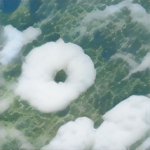
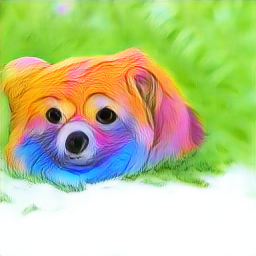
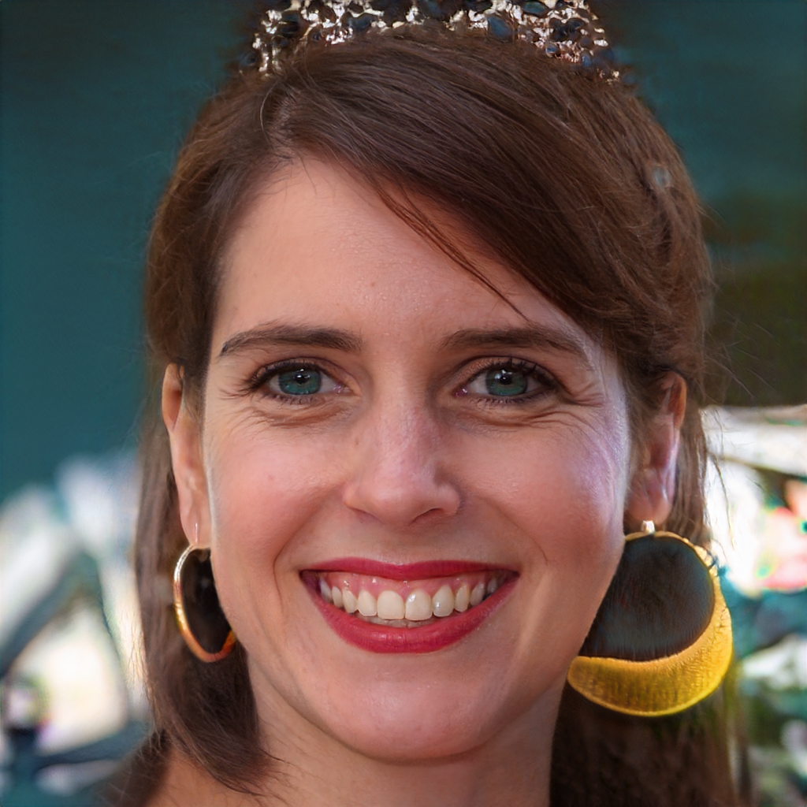

# This repository contains colab notebooks of interesting experiments on CLIP from different researchers and artists

After OpenAI released [CLIP](https://cdn.openai.com/papers/Learning_Transferable_Visual_Models_From_Natural_Language_Supervision.pdf) with its [inference code and pre-trained model](https://github.com/openai/CLIP), the Twitter community is coming up with much amazing work on top of this model. Below are some of colab experiments for my personal collection.

- ## Deep Daze: CLIP and SIREN Network

[Rayn Murdock](https://twitter.com/advadnoun) came up with amazing idea of generating image from text prompt by guiding [SIREN Network](https://vsitzmann.github.io/siren/) with CLIP.

Prompt: 'life during the plague'

[colab-badge]: <https://colab.research.google.com/assets/colab-badge.svg>

| Notebook | Author |
| :--- | :---:      |
| Original notebook [![Open In Colab][colab-badge]](https://colab.research.google.com/github/levindabhi/CLIP-Notebooks/blob/main/CLIP_%26_gradient_ascent_for_text_to_image_(Deep_Daze%20).ipynb) | [Ryan Murdock](https://twitter.com/advadnoun)
| Simplified notebook [![Open In Colab][colab-badge]](https://colab.research.google.com/github/levindabhi/CLIP-Notebooks/blob/main/Deep_Daze.ipynb) | [luciddrains](https://github.com/lucidrains/deep-daze)

 

- ## CLIP and BigGAN

Another amazing idea by [Rayn Murdock](https://twitter.com/advadnoun) (to the best of my knowledge) where CLIP is used to optimize latent vetor of BigGAN in such a way that BigGAN generator output image which has higher similar with input prompt.

Prompt: 'A cloud in shape of donut'

Prompt: 'A colorful cartoon of a dog'

Credits: [enricoros](https://github.com/lucidrains/big-sleep/issues/13)

| Notebook | AUthor |
| :--- | :---:      |
| Original notebook [![Open In Colab][colab-badge]](https://colab.research.google.com/github/levindabhi/CLIP-Notebooks/blob/main/The_Big_Sleep_BigGANxCLIP.ipynb) | [Ryan Murdock](https://twitter.com/advadnoun)
| Simplified notebook [![Open In Colab][colab-badge]](https://colab.research.google.com/github/levindabhi/CLIP-Notebooks/blob/main/ClipBigGAN.ipynb) | [eyalgruss.com](https://twitter.com/eyaler)

Update: Wooh! Someone put BigSleep on web at [https://dank.xyz/#](https://dank.xyz/#)

 

- ## Stylegan and CLIP
Generating an image from stylegan generator based on text prompt. Here similarity between generated image and input text is calculated using CLIP and it is combined with stylegan discriminator score to optimize input latent vector.
 
Prompt: 'A girl wearing crown'
 

 
Stylegan2 generator trained with FFHQ
 
 
Prompt: 'A queen sitting on chair'
 

 
Custom Stylegan2 generator used in <a href="https://thisanimedoesnotexist.ai/">thisanimedoesnotexist.ai</a>
 

| Notebook | AUthor |
| :--- | :---:      |
| Stylegan2/ada [![Open In Colab][colab-badge]](https://colab.research.google.com/github/levindabhi/CLIP-Notebooks/blob/main/CLIP_StyleGAN.ipynb) | [Levin Dabhi](https://twitter.com/DabhiLevin)
| Stylegan2 TADNE [![Open In Colab][colab-badge]](https://colab.research.google.com/github/nagolinc/notebooks/blob/main/CLIP_%2B_TADNE_(pytorch)_v2.ipynb) | [nagolinc](https://github.com/nagolinc/notebooks)

 

